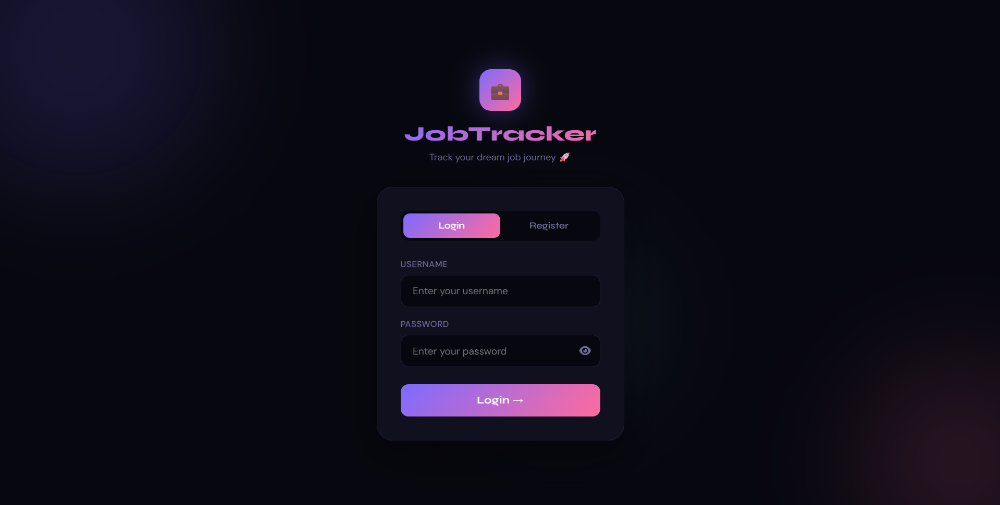
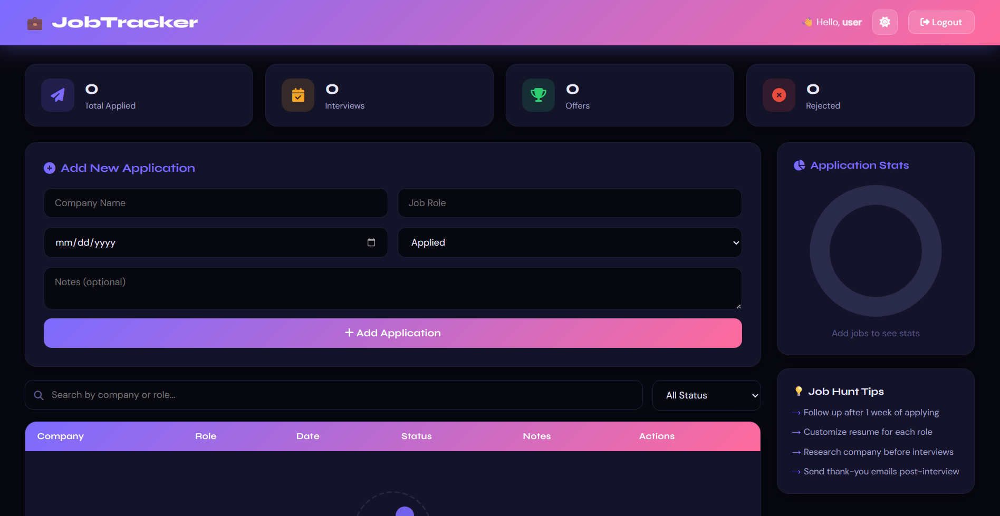

# job-application-tracker
# 💼 Job Application Tracker

A full-stack web application to help job seekers track their job applications, manage interview stages, and visualize their job hunt progress — all in one place.

🌐 **live:** [job-application-tracker-1-7sgf.onrender.com](https://job-application-tracker-1-7sgf.onrender.com)

---

## 📸 Preview





> Login Page → Dashboard with Stats → Application Table → Pie Chart

---

## ✨ Features

- 🔐 **User Authentication** — Secure Register & Login with password hashing (SHA-256)
- 📊 **Stats Dashboard** — Real-time counters for Total Applied, Interviews, Offers, and Rejections
- 🥧 **Interactive Pie Chart** — Visual breakdown of application statuses using Chart.js
- ➕ **Add Applications** — Track company name, role, date applied, status, and notes
- ✏️ **Edit & Delete** — Update application status or remove entries anytime
- 🔍 **Search & Filter** — Instantly search by company or role, filter by status
- 🌙 **Dark / Light Mode** — Toggle between themes, preference saved locally
- 🍞 **Toast Notifications** — Clean popup alerts for all actions
- 📱 **Fully Responsive** — Works on desktop, tablet, and mobile
- 💡 **Job Hunt Tips** — Built-in tips sidebar to guide your job search

---

## 🛠️ Tech Stack

| Layer | Technology |
|-------|-----------|
| Frontend | HTML5, CSS3, JavaScript (Vanilla) |
| Backend | Python, Flask |
| Database | SQLite |
| Charts | Chart.js |
| Icons | Font Awesome |
| Fonts | Google Fonts (Syne, DM Sans) |
| Hosting (Frontend) | GitHub Pages |
| Hosting (Backend) | Render.com |

---

## 📁 Project Structure

```
job-application-tracker/
├── backend/
│   ├── app.py              # Flask server & API routes
│   ├── requirements.txt    # Python dependencies
│   └── database.db         # SQLite database (auto-created)
├── frontend/
│   ├── login.html          # Login & Register page
│   ├── index.html          # Main dashboard
│   ├── style.css           # All styles with dark/light mode
│   └── script.js           # Frontend logic & API calls
├── render.yaml             # Render deployment config
└── README.md
```

---

## 🚀 Getting Started Locally

### Prerequisites
- Python 3.x installed
- pip installed

### Installation

**1. Clone the repository**
```bash
git clone https://github.com/SumitBehera720/job-application-tracker.git
cd job-application-tracker
```

**2. Install dependencies**
```bash
cd backend
pip install -r requirements.txt
```

**3. Run the backend**
```bash
python app.py
```
Backend runs at: `http://127.0.0.1:5000`

**4. Open the frontend**

Open `frontend/login.html` with Live Server in VS Code or any browser.

> Make sure `const API` in `script.js` and `login.html` is set to `http://127.0.0.1:5000` for local development.

---

## 🔌 API Endpoints

| Method | Endpoint | Description |
|--------|----------|-------------|
| POST | `/register` | Register a new user |
| POST | `/login` | Login user |
| POST | `/logout` | Logout user |
| GET | `/me` | Check session status |
| GET | `/jobs` | Get all jobs for logged-in user |
| POST | `/jobs` | Add a new job application |
| PUT | `/jobs/<id>` | Update job status/notes |
| DELETE | `/jobs/<id>` | Delete a job application |

---

## 🌍 Deployment

**Frontend** is hosted on **GitHub Pages**

**Backend** is hosted on **Render.com** (Free tier)

> ⚠️ Note: Free tier on Render spins down after 15 minutes of inactivity. First request may take 30-50 seconds to wake up the server.

---

## 📝 Environment Variables

Set this on Render under Environment Variables:

| Key | Value |
|-----|-------|
| `SECRET_KEY` | Your secret key string |

---

## 🙋‍♂️ Author

**Designed & Developed by Sumit Behera**

[](https://github.com/SumitBehera720)

---

## 📄 License

This project is open source and available under the [MIT License](LICENSE).
